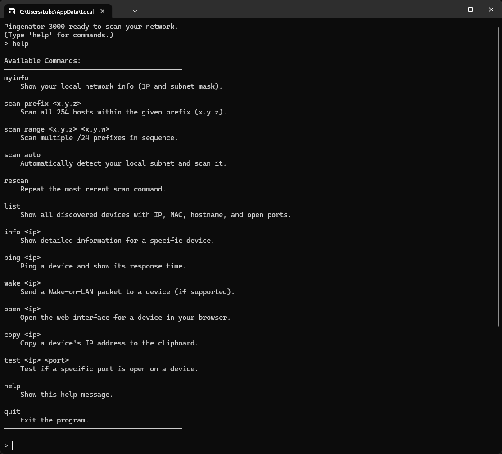

# LAN Network Scanner

A lightweight and multithreaded Windows command-line tool for discovering, pinging, and testing devices on your local network.

## About

Originally completed in October 2025. Later polished for general use.

## Preview



## Windows Only

- This tool is intended for Windows.
- Network discovery relies on system commands like `ping` and `arp`, and on how your Windows networking stack is configured.
- In some environments, `arp -a` may require elevated privileges. If discovery fails, re-run as Administrator.

## Getting Started

### Run from Source

1. Clone the repository.
2. Install the required dependencies:

```bash
pip install -r requirements.txt
```

3. Run the program:

```bash
python lan_network_scanner.py
```

### Windows Executable

A precompiled Windows executable is available from the GitHub Releases page.
